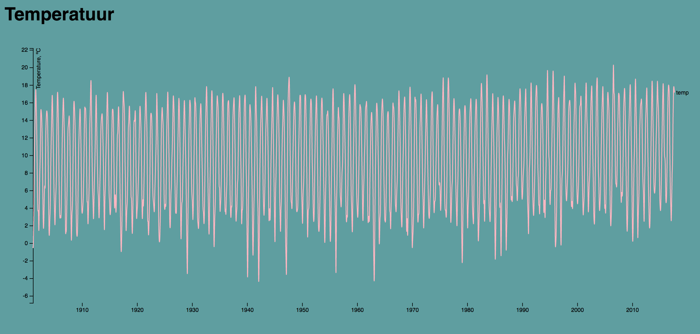

# Assessment 1

Homogenised monthly temperature time series of De Bilt (1901-present). Cleaned from [knmi.nl.](knmi.nl)
From: [Link](https://github.com/bryanvdelft/course-17-18/tree/master/assessment-1)

## Files
* index.html
* index.css
* indes.js
* data.csv
* readme.md

## Dataset

[Multi-Series Line Chart](https://bl.ocks.org/mbostock/3884955). I chose this chart because the example represents temperature across a long period of time. I think it's a good visualisation of the data I was given.  

## Proces

* Download the raw files from [link](https://github.com/bryanvdelft/course-17-18/blob/bar/assessment-1/temperature.csv)
* Chose the [Multi-Series Line Chart](https://bl.ocks.org/mbostock/3884955)
* Added the data from this chart to my own files.
* Changed ' d3.tsv("data.tsv") ' to ' d3.csv("data.csv") ' 
* Changed ' var city' to ' var temp '.
* Added comments

## Features

* [d3.axisBottom](https://github.com/d3/d3/blob/master/API.md#axes-d3-axis)
* [d3.scaleTime](https://github.com/d3/d3-scale)
* [d3.scaleOrdinal](https://github.com/d3/d3-scale)
* [d3.scaleLinear](https://github.com/d3/d3-scale)
* [d3.select](https://github.com/d3/d3-selection)
* [d3.csv](https://bl.ocks.org/mbostock/3305937)
* [d3.axisLeft](https://github.com/d3/d3/blob/master/API.md#axes-d3-axis)
* [d3.max](https://github.com/d3/d3-array)
* [d3.extent](https://github.com/d3/d3-array)
* [d3.line](https://github.com/d3/d3-shape)

## Sources

* [Multi-Series Line Chart](https://bl.ocks.org/mbostock/3884955)
* [D3 API Reference](https://github.com/d3/d3/blob/master/API.md#time-formats-d3-time-format)
* [Slack CMD Information](https://cmdinformationdesign.slack.com/messages/C6X4TNPQA/)
* [Assessment1](https://github.com/bryanvdelft/course-17-18/tree/master/assessment-1)

## License 

Released under the [GNU General Public License, version 3.](https://opensource.org/licenses/GPL-3.0)
